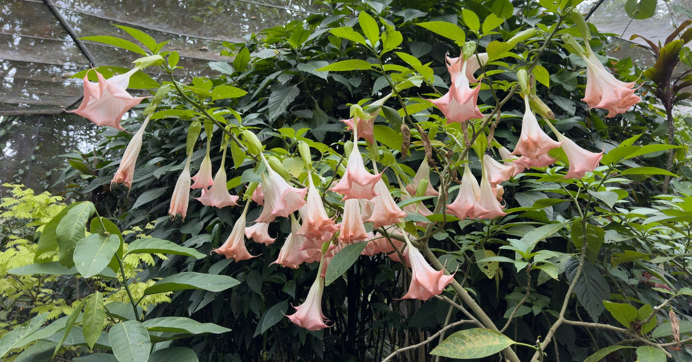

**MONSTERA**  
tropical plant (Mexico, Central America) 
leaves with holes and splits 
aerial roots to climb trees in the wild
  

**SANTAS NOCHES/BRUGMANSIA**  
también: trompeta de ángel, campanilla 
subtropical plant (México, Sudamérica)

**FALSO PIMENTERO/SCHINUS MOLLE**  
hojas perennes
no es exigente respecto al tipo de suelo, pero sí requiere buen drenaje
normalmente hasta 10m de alto, puede alcanzar 25m
corteza marrón pardo, color oscuro
las hojas, al caer y descomponerse alrededor del árbol, pueden generar un manto o suelo ácido que inhibe el crecimiento de otras plantas alrededor
 
 
 
